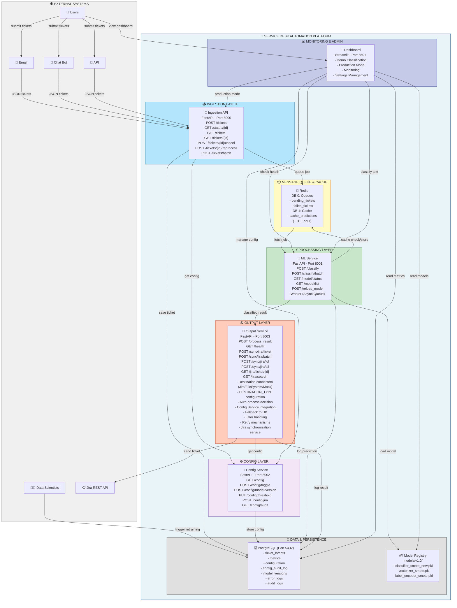
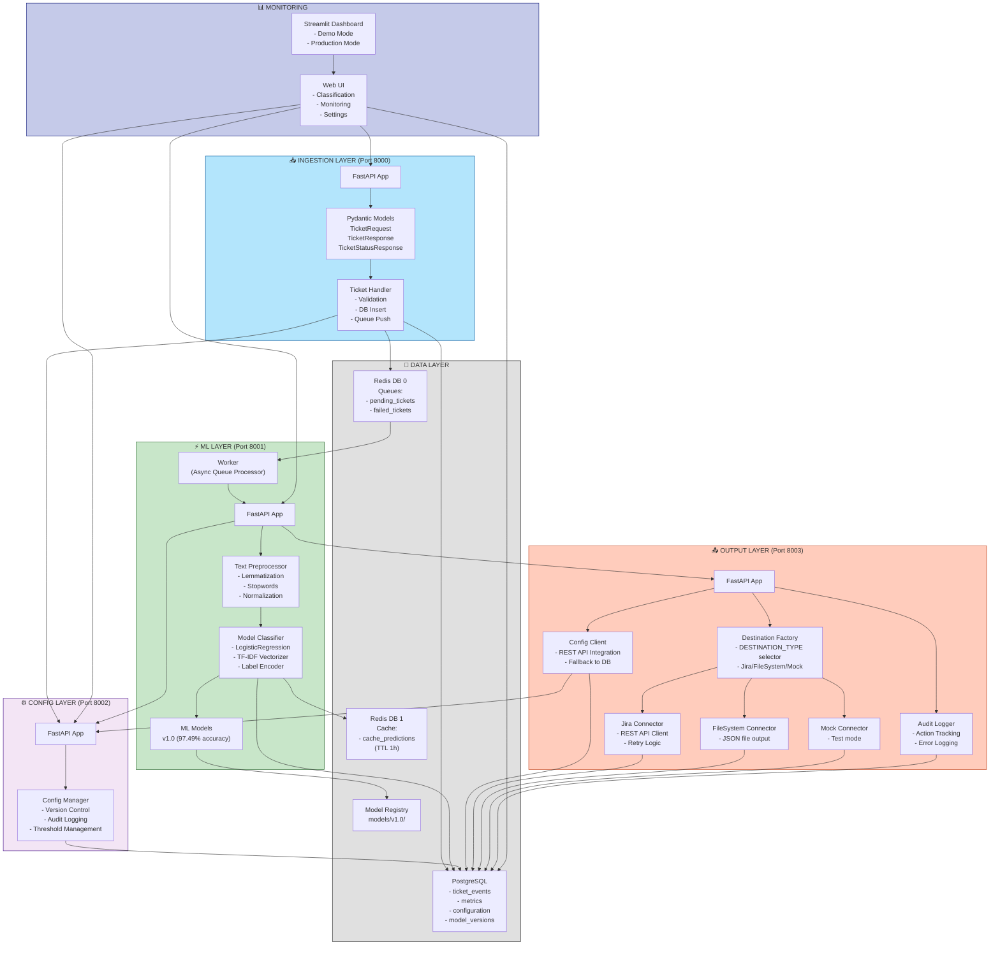
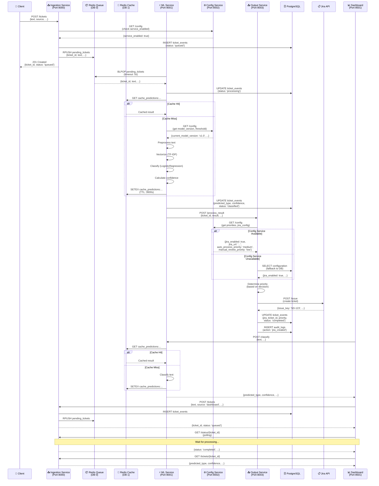
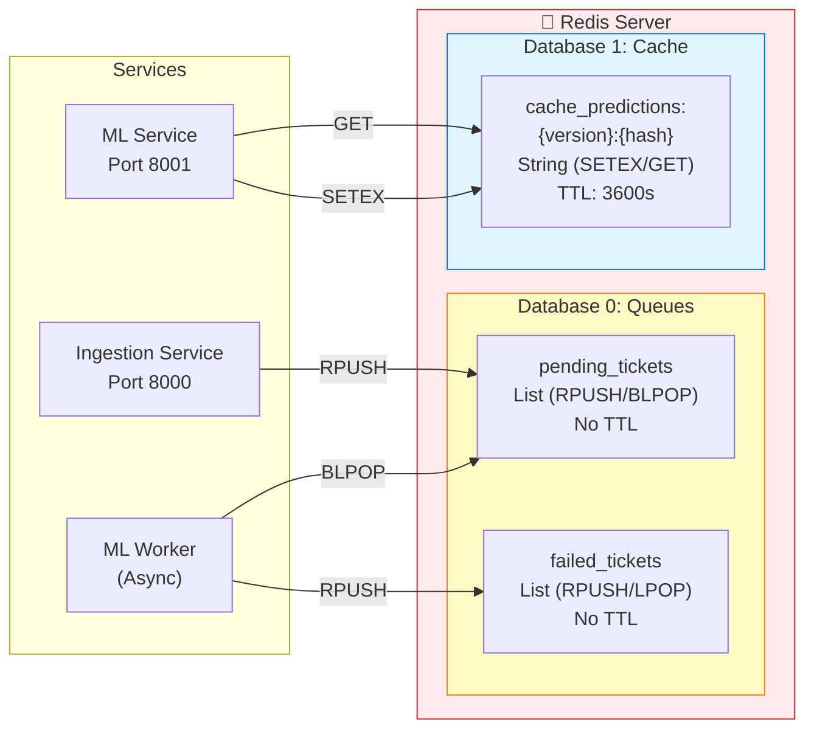
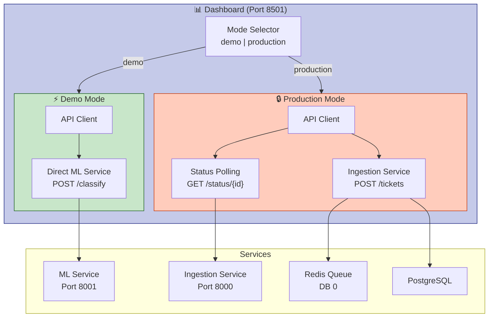
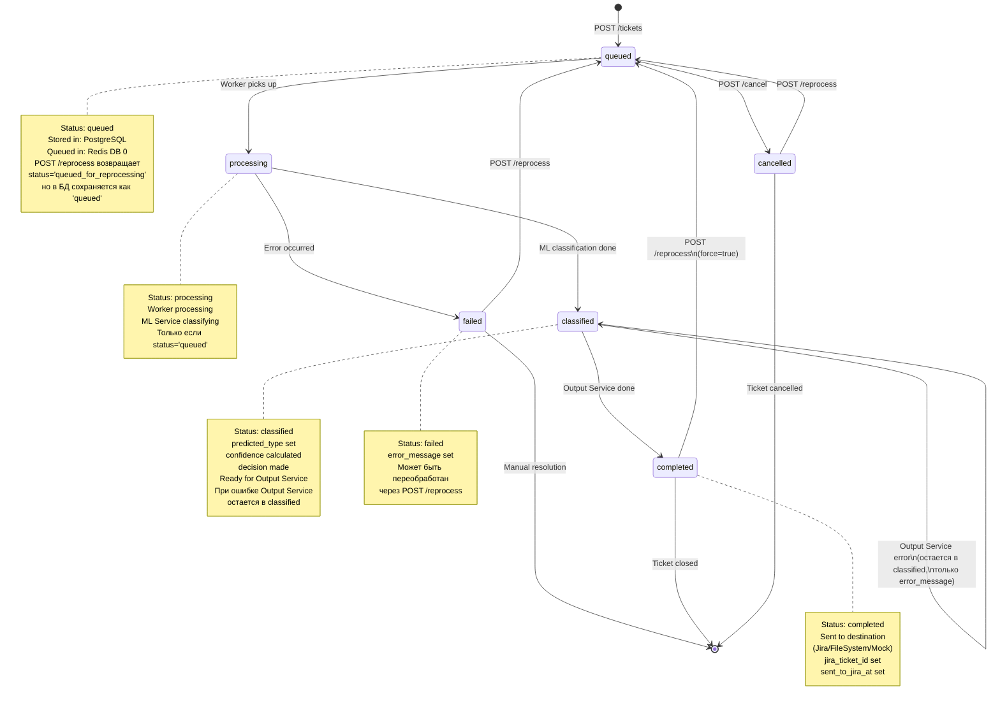

# Service Desk Classifier Architecture

Документ описывает архитектуру системы автоматической классификации обращений Service Desk с учетом текущей реализации.

**Дата обновления:** 2025-11-19  
**Версия:** 3.4 (актуализировано с учетом фактической реализации: добавлены эндпоинты синхронизации Jira, уточнены статусы и коннекторы)

---

## 1. Диаграмма контейнеров (Container Diagram)



---

## 2. Детальная архитектура компонентов (Component Diagram)



---

## 3. Поток данных (Data Flow Diagram)



---

## 4. Архитектура Redis (Redis Architecture)



---

## 5. Режимы работы Dashboard (Dashboard Modes)



---

## 6. Жизненный цикл тикета (Ticket Lifecycle)



---

## Разделение ответственности сервисов

### 1. Ingestion Service (Port 8000)
- ✅ Прием и валидация обращений (`POST /tickets`)
- ✅ Управление жизненным циклом тикетов
- ✅ Постановка в очередь Redis (DB 0)
- ✅ Сохранение в PostgreSQL (`ticket_events`)
- ✅ Проверка конфигурации через Config Service
- ❌ **НЕ выполняет классификацию** - классификация находится в ML Service

### 2. ML Service (Port 8001)
- ✅ Классификация текста через ML модель (`POST /classify`)
- ✅ Кэширование результатов в Redis (DB 1)
- ✅ Управление моделями (загрузка, перезагрузка, переключение версий)
- ✅ Автоматическая обработка очереди через Worker
- ✅ Запись метрик в PostgreSQL
- ✅ Проверка версии модели из Config Service

### 3. Config Service (Port 8002)
- ✅ Централизованное управление конфигурацией
- ✅ Аудит изменений (`config_audit_log`)
- ✅ Управление версиями моделей
- ✅ Управление порогами уверенности
- ✅ Управление настройками Jira

### 4. Output Service (Port 8003)
- ✅ Обработка результатов классификации
- ✅ Плагинные коннекторы назначения (Destination Connectors):
  - **Jira Connector:** отправка в Jira REST API (требует `DESTINATION_TYPE=jira`)
    - Поддерживает стандартный Jira REST API (`/rest/api/3/issue`)
    - Поддерживает Jira Service Desk API (`/rest/servicedeskapi/request`) при `JIRA_USE_SERVICEDESK_API=true`
  - **FileSystem Connector:** сохранение JSON файлов в `OUTPUT_DIR` (по умолчанию, `DESTINATION_TYPE=filesystem` или `fs` или `file`)
  - **Mock Connector:** тестовый режим без отправки (`DESTINATION_TYPE=mock`)
- ✅ Выбор коннектора через переменную окружения `DESTINATION_TYPE`
- ✅ Определение приоритетов из Config Service (auto_process_priority, manual_review_priority)
- ✅ Интеграция с Config Service API с fallback на БД
- ✅ Retry механизмы для Jira
- ✅ Аудит действий (`audit_logs`)
- ✅ Отправка только при `decision=auto-process`
- ✅ Синхронизация данных из Jira для дообучения модели (JiraSyncService)
  - Синхронизация actual_type, feedback_status из Jira в PostgreSQL
  - Поддержка пакетной синхронизации и синхронизации по JQL

### 5. Dashboard (Port 8501)
- ✅ **Demo режим:** Прямая классификация через ML Service (без логирования в БД)
- ✅ **Production режим:** Полный pipeline через Ingestion Service (с логированием в `ticket_events`)
- ✅ Мониторинг системы
- ✅ Управление конфигурацией
- ✅ Просмотр метрик и истории

---

## Ключевые эндпоинты

### Ingestion Service (Port 8000)
- `POST /tickets` - создание обращения
- `GET /tickets` - список обращений (с фильтрацией)
- `GET /tickets/{id}` - детали обращения
- `GET /status/{ticket_id}` - статус обработки с прогрессом
- `POST /tickets/{id}/cancel` - отменить обработку
- `POST /tickets/{id}/reprocess` - переобработать
- `POST /tickets/batch` - пакетная загрузка
- `GET /health` - проверка работоспособности

### ML Service (Port 8001)
- `POST /classify` - **классификация текста (только здесь!)**
- `POST /classify/batch` - пакетная классификация
- `GET /model/status` - статус модели
- `GET /model/list` - список моделей
- `POST /reload_model` - перезагрузка модели
- `GET /health` - проверка работоспособности

### Config Service (Port 8002)
- `GET /config` - текущая конфигурация
- `POST /config/toggle` - включить/отключить сервис
- `POST /config/model-version` - переключить версию модели
- `POST /config/model-switch` - алиас для `/config/model-version`
- `PUT /config/threshold` - изменить порог уверенности
- `POST /config/jira` - настройка Jira
- `GET /config/audit` - история изменений
- `GET /health` - проверка работоспособности

### Output Service (Port 8003)
- `POST /process_result` - обработка результата классификации
  - Принимает результаты классификации от ML Service Worker
  - Определяет приоритет на основе decision (auto-process/manual-review)
  - Отправляет в выбранное назначение при `decision=auto-process`
  - Обновляет `ticket_events` и записывает в `audit_logs`
- `GET /health` - проверка работоспособности
  - Проверяет подключение к PostgreSQL
  - Показывает статус Jira (если `DESTINATION_TYPE=jira`)
- `POST /sync/jira/ticket` - синхронизация одного тикета из Jira
  - Получает данные тикета из Jira и обновляет actual_type, feedback_status в PostgreSQL
- `POST /sync/jira/batch` - пакетная синхронизация тикетов из Jira
- `POST /sync/jira/jql` - синхронизация тикетов по JQL запросу
- `POST /sync/jira/all` - синхронизация всех тикетов с jira_ticket_id
- `GET /jira/ticket/{jira_ticket_id}` - получение данных тикета из Jira (без синхронизации)
- `GET /jira/search` - поиск тикетов в Jira по JQL (без синхронизации)

---

## Поток данных

### 1. Создание обращения (Production Flow)
```
Клиент → Ingestion Service (POST /tickets)
  → Проверка Config Service (service_enabled)
  → Сохранение в PostgreSQL (ticket_events, status: 'queued')
  → Добавление в очередь Redis DB 0 (pending_tickets)
  → Ответ клиенту (ticket_id, status: 'queued', created_at, estimated_processing_time: 2000ms)
```

### 2. Классификация (Worker Mode)
```
ML Service Worker → Redis DB 0 (BLPOP pending_tickets, timeout: 5s)
  → Проверка статуса тикета в БД (должен быть 'queued')
  → Обновление статуса в PostgreSQL (status: 'processing')
  → Проверка версии модели из Config Service (автоперезагрузка при несоответствии)
  → Проверка кэша Redis DB 1 (cache_predictions:{version}:{hash})
  → Если нет в кэше:
    → Получение порога уверенности из Config Service
    → Предобработка текста
    → Векторизация (TF-IDF)
    → Классификация (LogisticRegression)
    → Сохранение в кэш Redis DB 1 (TTL: 3600s)
  → Определение decision (auto-process/manual-review) по порогу
  → Обновление PostgreSQL (predicted_type, confidence, probabilities, decision, model_version, status: 'classified', processed_at)
  → Отправка в Output Service (POST /process_result)
```

### 3. Обработка результата
```
Output Service (POST /process_result)
  → Получение конфигурации из Config Service API (GET /config):
    - Приоритеты (auto_process_priority, manual_review_priority)
    - Jira конфигурация (jira_enabled, jira_url, jira_user, jira_api_token, jira_project_key)
  → Fallback на БД при недоступности Config Service
  → Определение приоритета на основе decision:
    - decision='auto-process' → auto_process_priority (default: 'medium')
    - decision='manual-review' → manual_review_priority (default: 'low')
  → Выбор коннектора назначения через DESTINATION_TYPE:
    - DESTINATION_TYPE=jira → JiraConnector
    - DESTINATION_TYPE=filesystem → FileSystemConnector (по умолчанию)
    - DESTINATION_TYPE=mock → MockConnector
  → Отправка в назначение при decision=auto-process:
    - Jira: создание тикета через REST API с retry механизмами (MAX_RETRY_ATTEMPTS)
    - FileSystem: сохранение JSON в OUTPUT_DIR (default: ./out), формат: {ticket_id}_{timestamp}.json
    - Mock: генерация external_id в формате MOCK-{timestamp} без реальной отправки
  → Обновление PostgreSQL:
    - ticket_events: jira_ticket_id (или external_id), jira_link (или file path), priority, status: 'completed', sent_to_jira_at
    - audit_logs: запись действия (jira_created/filesystem_saved/mock_generated)
```

### 4. Dashboard - Demo Mode
```
Dashboard → ML Service (POST /classify)
  → Проверка кэша Redis DB 1
  → Классификация (если нет в кэше)
  → Сохранение в кэш
  → Возврат результата
  ❌ НЕ создает запись в ticket_events
```

### 5. Dashboard - Production Mode
```
Dashboard → Ingestion Service (POST /tickets)
  → Создание записи в ticket_events
  → Добавление в очередь Redis DB 0
  → Polling статуса (GET /status/{ticket_id})
  → Получение результата (GET /tickets/{ticket_id})
  ✅ Создает запись в ticket_events
```

---

## Интеграции между сервисами

- **Ingestion ↔ Config:** Проверка `service_enabled` перед созданием обращений
- **ML ↔ Config:** Чтение `current_model_version` и `confidence_threshold`, автоматическая перезагрузка модели при несоответствии
- **ML ↔ Output:** Отправка результатов классификации через Worker
- **Output ↔ Config:** Чтение приоритетов (auto_process_priority, manual_review_priority) и Jira конфигурации (jira_enabled, jira_url) через REST API с автоматическим fallback на БД при недоступности Config Service
- **Dashboard ↔ ML/Config:** Управление конфигурацией и классификация текста
- **Dashboard ↔ Ingestion:** Production режим с полным логированием

---

## Архитектурные решения

### Разделение Redis на базы данных
- **DB 0 (Queues):** Очереди задач (pending_tickets, failed_tickets)
  - Временные данные, удаляются после обработки
  - Использует Redis List структуру данных
  - Операции: `RPUSH` (добавление в конец), `BLPOP`/`LPOP` (извлечение из начала)
  - Нет TTL (данные живут до обработки)
  - Высокая производительность операций вставки/извлечения
  - Переменные окружения: `REDIS_DB_QUEUES=0` (по умолчанию)

- **DB 1 (Cache):** Кэш результатов (cache_predictions)
  - Данные с TTL (3600 секунд по умолчанию)
  - Использует Redis String структуру данных
  - Операции: `SETEX` (установка с TTL), `GET` (получение)
  - Формат ключа: `cache_predictions:{model_version}:{text_hash}`
    - `model_version` - версия модели (например, v1.0)
    - `text_hash` - MD5 хэш текста обращения
  - Автоматическое удаление устаревших данных
  - Оптимизация повторных запросов
  - Переменные окружения: `REDIS_DB_CACHE=1` (по умолчанию)

**Общие переменные окружения Redis:**
- `REDIS_HOST` - хост Redis (по умолчанию: localhost)
- `REDIS_PORT` - порт Redis (по умолчанию: 6379)
- `REDIS_PASSWORD` - пароль Redis (опционально)

### Режимы работы Dashboard
- **Demo Mode:** Быстрая классификация без логирования (для тестирования)
- **Production Mode:** Полный pipeline с логированием в `ticket_events` (для production)

### Асинхронная обработка
- Worker в ML Service обрабатывает очередь Redis асинхронно
- Поддержка retry механизмов для failed tickets
- Неблокирующая обработка большого количества тикетов

### Интеграция Output Service с Config Service
- Output Service получает конфигурацию через REST API (GET /config)
- Автоматический fallback на прямое чтение из БД при недоступности Config Service
- Получаемые параметры:
  - Приоритеты: `auto_process_priority`, `manual_review_priority`
  - Jira конфигурация: `jira_enabled`, `jira_url` (для JiraConnector)
- Обеспечивает отказоустойчивость системы

### Destination Connectors в Output Service
- **Плагинная архитектура:** выбор коннектора через переменную окружения `DESTINATION_TYPE`
- **JiraConnector:** отправка тикетов в Jira REST API
  - Требует `DESTINATION_TYPE=jira`
  - Использует конфигурацию из Config Service (jira_url, jira_user, jira_api_token)
  - Поддерживает два режима:
    - Стандартный Jira REST API (`/rest/api/3/issue`) - по умолчанию
    - Jira Service Desk API (`/rest/servicedeskapi/request`) - при `JIRA_USE_SERVICEDESK_API=true`
  - Для Service Desk API требуется `JIRA_SERVICE_DESK_ID` и `JIRA_REQUEST_TYPE_ID`
  - Поддерживает retry механизмы (MAX_RETRY_ATTEMPTS)
  - Опциональная проверка подключения через `JIRA_VALIDATE_CONNECTION`
- **FileSystemConnector:** сохранение результатов в JSON файлы
  - По умолчанию (`DESTINATION_TYPE=filesystem`, `fs` или `file`)
  - Сохраняет в директорию `OUTPUT_DIR` (по умолчанию `./out`)
  - Формат файла: `{ticket_id}_{timestamp}.json`
  - Поддерживает нормализацию кодировки UTF-8 (исправление проблем с Windows-1251)
- **MockConnector:** тестовый режим
  - `DESTINATION_TYPE=mock`
  - Генерирует external_id в формате `MOCK-{timestamp}` без реальной отправки
  - Используется для тестирования без внешних зависимостей

### Jira Synchronization Service
- **Назначение:** Синхронизация данных из Jira в PostgreSQL для дообучения модели
- **Функциональность:**
  - Извлечение категории из Jira (custom fields, labels, components, issue type)
  - Обновление `actual_type` в PostgreSQL при расхождении с `predicted_type`
  - Обновление `feedback_status` и `feedback_correct_type` для обратной связи
  - Пометка тикетов как `training_ready` для дообучения
- **Эндпоинты:**
  - `POST /sync/jira/ticket` - синхронизация одного тикета
  - `POST /sync/jira/batch` - пакетная синхронизация
  - `POST /sync/jira/jql` - синхронизация по JQL запросу
  - `POST /sync/jira/all` - синхронизация всех тикетов с jira_ticket_id
  - `GET /jira/ticket/{jira_ticket_id}` - получение данных из Jira (без синхронизации)
  - `GET /jira/search` - поиск в Jira по JQL (без синхронизации)

---

**Важно:** `POST /classify` находится **только в ML Service (Port 8001)**, а не в Ingestion Service. Это правильное разделение ответственности в микросервисной архитектуре.

**Дата обновления:** 2025-11-19  
**Версия:** 3.4 (актуализировано с учетом фактической реализации: добавлены эндпоинты синхронизации Jira, уточнены статусы и коннекторы)

