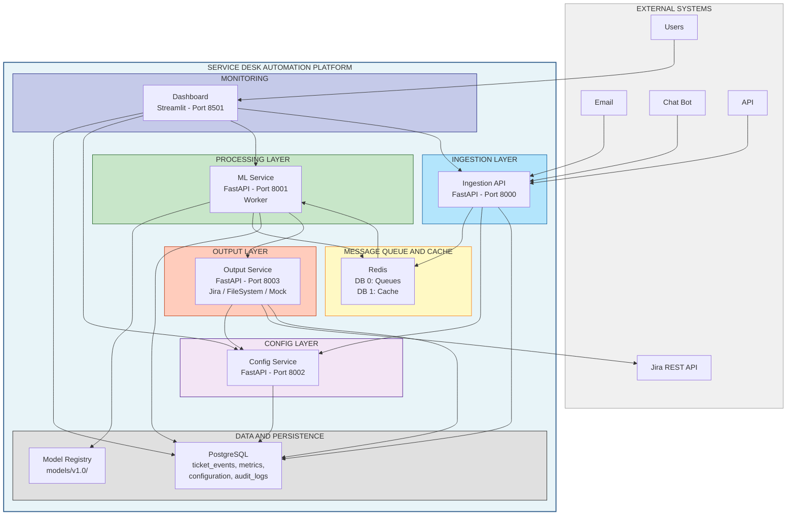
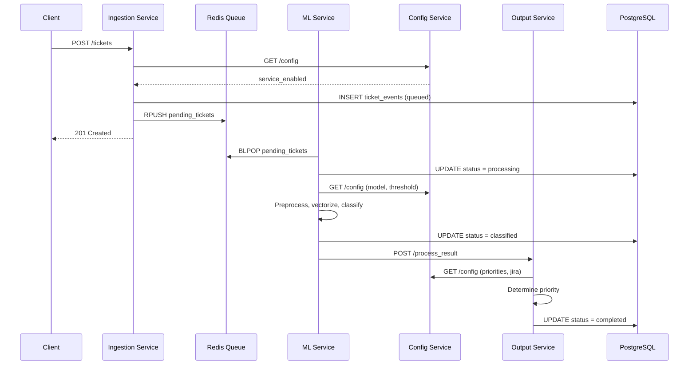
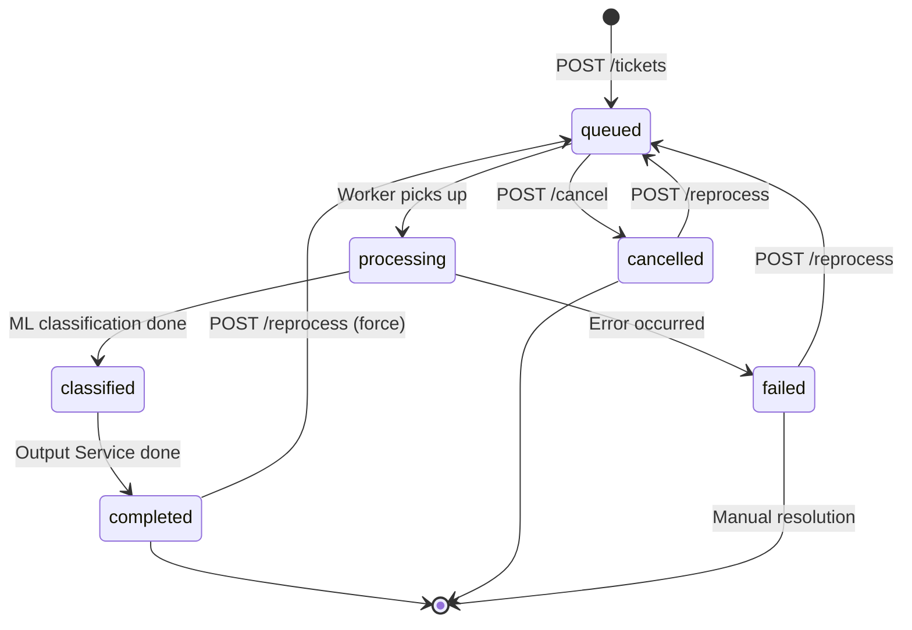

# Service Desk Classifier

Микросервисная платформа для автоматической классификации обращений IT Service Desk с использованием машинного обучения. Система принимает текстовые обращения, классифицирует их на 17 категорий, принимает решение об автоматической обработке или ручной проверке и направляет результат во внешние системы.

## Ключевые возможности

- **Микросервисная архитектура** — пять независимых сервисов с чётким разделением ответственности
- **ML-классификация** — TF-IDF + Logistic Regression, 17 категорий обращений, порог уверенности для auto-process / manual-review
- **Асинхронная обработка** — очередь Redis и фоновый Worker в ML Service
- **Кэширование предсказаний** — Redis DB 1, TTL 1 час, снижение нагрузки на модель
- **Плагинные коннекторы вывода** — Jira REST API, файловая система, mock-режим
- **Централизованная конфигурация** — Config Service с аудитом изменений и fallback на БД
- **Мониторинг и демо** — Streamlit Dashboard (demo и production режимы)
- **Структурированное логирование** — JSON-логи, готовность к интеграции с ElasticSearch

## Технологический стек

| Категория | Технологии |
|-----------|------------|
| Backend | Python 3.11+, FastAPI, Uvicorn, Pydantic |
| ML | scikit-learn, pymorphy3, nltk |
| Данные | PostgreSQL 15, Redis 7 |
| Frontend | Streamlit |
| Инфраструктура | Docker, Docker Compose |

## Архитектура

### Обзор системы



### Поток обработки обращения



### Жизненный цикл тикета



Подробные диаграммы компонентов, Redis и режимов Dashboard — в [ARCHITECTURE.md](ARCHITECTURE.md).

## Сервисы

| Сервис | Порт | Назначение |
|--------|------|------------|
| Ingestion Service | 8000 | Приём обращений, валидация, постановка в очередь |
| ML Service | 8001 | Классификация текста, кэш, Worker для очереди |
| Config Service | 8002 | Конфигурация, пороги, версии моделей, аудит |
| Output Service | 8003 | Публикация результатов (Jira / файлы / mock) |
| Dashboard | 8501 | Демо, мониторинг, управление настройками |
| PostgreSQL | 5432 | Хранение тикетов, метрик, конфигурации |
| Redis | 6379 | Очереди (DB 0) и кэш предсказаний (DB 1) |

## Быстрый старт

### Требования

- Docker и Docker Compose
- Для локального запуска без Docker: Python 3.11+, PostgreSQL 15, Redis 7

### Запуск через Docker Compose

```bash
git clone https://github.com/JungleAll/service-desk-classifier.git
cd service-desk-classifier
docker compose up -d
```

Проверка сервисов:

| Сервис | URL |
|--------|-----|
| Ingestion API | http://localhost:8000/docs |
| ML API | http://localhost:8001/docs |
| Config API | http://localhost:8002/docs |
| Output API | http://localhost:8003/docs |
| Dashboard | http://localhost:8501 |

### ML-модели

Артефакты обученной модели (`.pkl`) **не включены** в репозиторий — они обучались на продуктовых данных и исключены по соображениям конфиденциальности.

Для запуска ML Service необходимо:

1. Обучить модель по инструкции в [quick-start-guide.md](quick-start-guide.md)
2. Разместить файлы в `models/v1.0/` (см. [models/v1.0/README_models.md](models/v1.0/README_models.md))

### Пример: создание и проверка обращения

```bash
# Создать обращение
curl -X POST http://localhost:8000/tickets \
  -H "Content-Type: application/json" \
  -d '{"text": "Не работает доступ к корпоративному VPN", "source": "api"}'

# Проверить статус
curl http://localhost:8000/status/{ticket_id}
```

Подробные инструкции по локальному запуску — в [startup-guide.md](startup-guide.md).

## Структура проекта

```
service-desk-classifier/
├── ingestion_service/     # Приём обращений
├── ml_service/            # Классификация и Worker
├── config_service/        # Централизованная конфигурация
├── output_service/        # Публикация результатов
├── dashboard/             # Streamlit UI
├── shared/                # Общие модули (БД, Redis, логирование)
├── database/              # Схема PostgreSQL и миграции
├── models/                # Реестр ML-моделей
└── docker-compose.yml
```

## Документация

| Документ | Описание |
|----------|----------|
| [ARCHITECTURE.md](ARCHITECTURE.md) | Архитектура, диаграммы, потоки данных, API-эндпоинты |
| [API_REFERENCE.md](API_REFERENCE.md) | Справочник REST API всех сервисов |
| [PROJECT_GUIDE.md](PROJECT_GUIDE.md) | Полный путеводитель по проекту |
| [startup-guide.md](startup-guide.md) | Пошаговый запуск (Docker и локально) |
| [SCALING_GUIDE.md](SCALING_GUIDE.md) | Стратегии масштабирования |
| [quick-start-guide.md](quick-start-guide.md) | Быстрое обучение ML-модели |

Документация по отдельным компонентам — в README соответствующих каталогов (`ingestion_service/`, `ml_service/`, `config_service/`, `output_service/`, `dashboard/`, `shared/`, `database/`).

## Лицензия

[Apache License 2.0](LICENSE)
