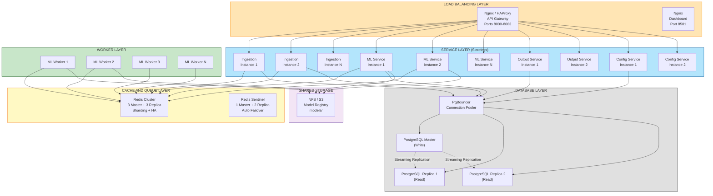

# Руководство по масштабированию Service Desk Classifier

Документ описывает стратегии и рекомендации по масштабированию системы автоматической классификации обращений Service Desk при увеличении нагрузки.

**Дата создания:** 2025-01-22  
**Версия:** 1.0

---

## Содержание

1. [Текущая архитектура и узкие места](#текущая-архитектура-и-узкие-места)
2. [Стратегии горизонтального масштабирования](#стратегии-горизонтального-масштабирования)
3. [Масштабирование компонентов](#масштабирование-компонентов)
4. [Масштабирование хранилищ данных](#масштабирование-хранилищ-данных)
5. [Мониторинг и автоскейлинг](#мониторинг-и-автоскейлинг)
6. [Сценарии нагрузки](#сценарии-нагрузки)
7. [Рекомендации по внедрению](#рекомендации-по-внедрению)

---

## 1. Текущая архитектура и узкие места

### 1.1. Текущее состояние

**Компоненты системы:**
- **Ingestion Service** (Port 8000) - 1 инстанс
- **ML Service** (Port 8001) - 1 инстанс + 1 Worker
- **Config Service** (Port 8002) - 1 инстанс
- **Output Service** (Port 8003) - 1 инстанс
- **PostgreSQL** - 1 инстанс (Connection Pool: min=1, max=10)
- **Redis** - 1 инстанс (DB 0: Queues, DB 1: Cache)
- **Dashboard** (Port 8501) - 1 инстанс

### 1.2. Потенциальные узкие места

#### Критические узкие места:

1. **ML Service Worker** - единственный воркер обрабатывает очередь последовательно
   - Текущая производительность: ~1-2 классификации/сек
   - При росте нагрузки очередь `pending_tickets` будет расти
   
2. **PostgreSQL Connection Pool** - ограничен 10 соединениями
   - При 5+ сервисах может возникнуть конкуренция за соединения
   
3. **Redis Single Instance** - единая точка отказа
   - Нет репликации или кластеризации
   - Потеря Redis = потеря очереди и кэша

4. **ML Model Loading** - модель загружается в память один раз
   - Модель не shared между инстансами
   - Каждый новый ML Service инстанс загружает свою копию

#### Вторичные узкие места:

5. **Output Service Jira Integration** - синхронные запросы к Jira
   - Retry механизмы могут замедлить обработку
   
6. **Config Service** - единая точка конфигурации
   - При недоступности используется fallback на БД, но это замедляет работу

---

## 2. Стратегии горизонтального масштабирования

### 2.1. Архитектура для масштабирования



### 2.2. Ключевые принципы масштабирования

1. **Stateless Services** - все сервисы должны быть без состояния
2. **Shared Nothing Architecture** - минимизация shared state
3. **Horizontal Pod Autoscaling** - автоматическое масштабирование по метрикам
4. **Load Balancing** - распределение нагрузки между инстансами
5. **Circuit Breaker Pattern** - защита от каскадных сбоев
6. **Graceful Degradation** - деградация функциональности при перегрузке

---

## 3. Масштабирование компонентов

### 3.1. Ingestion Service (Port 8000)

#### Текущая конфигурация:
- 1 инстанс FastAPI
- Работа: валидация → PostgreSQL → Redis Queue

#### Стратегия масштабирования:

**Этап 1: Горизонтальное масштабирование (2-5 инстансов)**

```yaml
# docker-compose.yml (пример)
ingestion-service:
  deploy:
    replicas: 3
    resources:
      limits:
        cpus: '1.0'
        memory: 512M
      reservations:
        cpus: '0.5'
        memory: 256M
```

**Этап 2: Load Balancer**

```nginx
# nginx.conf
upstream ingestion_backend {
    least_conn;  # Наименее нагруженный инстанс
    server ingestion-1:8000 max_fails=3 fail_timeout=30s;
    server ingestion-2:8000 max_fails=3 fail_timeout=30s;
    server ingestion-3:8000 max_fails=3 fail_timeout=30s;
}

server {
    listen 8000;
    location / {
        proxy_pass http://ingestion_backend;
        proxy_set_header X-Real-IP $remote_addr;
        proxy_set_header X-Forwarded-For $proxy_add_x_forwarded_for;
    }
}
```

**Этап 3: Kubernetes Autoscaling**

```yaml
# ingestion-hpa.yaml
apiVersion: autoscaling/v2
kind: HorizontalPodAutoscaler
metadata:
  name: ingestion-service-hpa
spec:
  scaleTargetRef:
    apiVersion: apps/v1
    kind: Deployment
    name: ingestion-service
  minReplicas: 2
  maxReplicas: 10
  metrics:
  - type: Resource
    resource:
      name: cpu
      target:
        type: Utilization
        averageUtilization: 70
  - type: Resource
    resource:
      name: memory
      target:
        type: Utilization
        averageUtilization: 80
```

**Производительность:**
- 1 инстанс: ~500 req/sec
- 3 инстанса: ~1500 req/sec
- 10 инстансов: ~5000 req/sec

---

### 3.2. ML Service (Port 8001) - КРИТИЧНО

#### Текущая конфигурация:
- 1 FastAPI инстанс + 1 Worker
- Worker: `WORKER_QUEUE_TIMEOUT=5`, `WORKER_DELAY=0.1`
- Model в памяти: ~200-500 MB

#### Стратегия масштабирования:

**Проблема:** Worker обрабатывает очередь последовательно (`BLPOP` → classify → Output)

**Решение 1: Множественные Worker инстансы**

```yaml
# docker-compose.yml
services:
  ml-worker-1:
    <<: *ml-service-base
    container_name: ml-worker-1
    environment:
      - WORKER_ENABLED=true
      - WORKER_ID=1
  
  ml-worker-2:
    <<: *ml-service-base
    container_name: ml-worker-2
    environment:
      - WORKER_ENABLED=true
      - WORKER_ID=2
  
  ml-worker-3:
    <<: *ml-service-base
    container_name: ml-worker-3
    environment:
      - WORKER_ENABLED=true
      - WORKER_ID=3

  ml-api:
    <<: *ml-service-base
    container_name: ml-api
    environment:
      - WORKER_ENABLED=false  # API без воркера
    ports:
      - "8001:8001"
```

**Преимущества:**
- Worker'ы конкурируют за задачи из Redis (`BLPOP` атомарен)
- Линейное увеличение пропускной способности
- API отделен от Worker'ов

**Решение 2: Model Serving с TensorFlow Serving / Triton**

```yaml
# Для больших моделей или GPU inference
services:
  triton-server:
    image: nvcr.io/nvidia/tritonserver:23.08-py3
    volumes:
      - ./models:/models
    command: tritonserver --model-repository=/models
    deploy:
      resources:
        reservations:
          devices:
            - driver: nvidia
              count: 1
              capabilities: [gpu]
```

**Решение 3: Разделение API и Worker**

```
ml-service/
├── api.py           # FastAPI без Worker
├── worker.py        # Standalone Worker процесс
└── docker-compose.yml
```

```yaml
# Отдельные контейнеры
ml-api:
  build: ./ml_service
  command: ["python", "-m", "uvicorn", "app:app", "--host", "0.0.0.0"]
  deploy:
    replicas: 3  # Масштабируем API

ml-worker:
  build: ./ml_service
  command: ["python", "worker_standalone.py"]
  deploy:
    replicas: 5  # Масштабируем Worker
```

**Производительность:**
- 1 Worker: ~1-2 classifications/sec
- 3 Workers: ~3-6 classifications/sec
- 10 Workers: ~10-20 classifications/sec
- С GPU (Triton): ~100-1000 classifications/sec

**Важно:** Shared Model Storage (NFS/S3) для консистентности версий модели между инстансами.

---

### 3.3. Config Service (Port 8002)

#### Текущая конфигурация:
- 1 инстанс
- Конфигурация в PostgreSQL
- Fallback механизмы в других сервисах

#### Стратегия масштабирования:

**Этап 1: Read Replicas (2-3 инстанса)**

```yaml
config-service:
  deploy:
    replicas: 2
  environment:
    - ENABLE_CACHE=true
    - CACHE_TTL=60  # Кэширование конфигурации на 60 секунд
```

**Этап 2: Распределенный кэш конфигурации**

```python
# config_service/config.py
import redis

config_cache = redis.Redis(host='redis', db=2)  # Отдельная DB для конфига

def get_config_cached():
    cached = config_cache.get('config:current')
    if cached:
        return json.loads(cached)
    
    config = fetch_from_db()
    config_cache.setex('config:current', 60, json.dumps(config))
    return config
```

**Производительность:**
- 1 инстанс: ~1000 req/sec (с кэшем)
- 2-3 инстанса: достаточно для большинства сценариев

---

### 3.4. Output Service (Port 8003)

#### Текущая конфигурация:
- 1 инстанс
- Синхронные вызовы Jira (с retry)
- 3 коннектора: Jira, FileSystem, Mock

#### Стратегия масштабирования:

**Этап 1: Горизонтальное масштабирование (2-5 инстансов)**

```yaml
output-service:
  deploy:
    replicas: 3
    resources:
      limits:
        cpus: '0.5'
        memory: 256M
```

**Этап 2: Асинхронная обработка Jira запросов**

```python
# output_service/jira_async.py
import asyncio
import httpx

async def send_to_jira_async(payload):
    async with httpx.AsyncClient() as client:
        response = await client.post(jira_url, json=payload)
        return response.json()

# Батчинг запросов
async def batch_send_to_jira(payloads):
    tasks = [send_to_jira_async(p) for p in payloads]
    return await asyncio.gather(*tasks, return_exceptions=True)
```

**Этап 3: Circuit Breaker для Jira**

```python
from pybreaker import CircuitBreaker

jira_breaker = CircuitBreaker(
    fail_max=5,
    timeout_duration=60,
    exclude=[requests.HTTPError]
)

@jira_breaker
def send_to_jira(payload):
    # Отправка в Jira
    pass
```

**Производительность:**
- 1 инстанс: ~50-100 Jira requests/sec
- 3 инстанса: ~150-300 Jira requests/sec

---

## 4. Масштабирование хранилищ данных

### 4.1. PostgreSQL

#### Текущая конфигурация:
- 1 инстанс PostgreSQL 15
- Connection Pool: SimpleConnectionPool (min=1, max=10)

#### Стратегия масштабирования:

**Этап 1: Увеличение Connection Pool**

```python
# shared/database.py
def init_pool(minconn: int = 5, maxconn: int = 50):
    """Увеличенный пул соединений"""
    _pool = SimpleConnectionPool(
        minconn=minconn,
        maxconn=maxconn,
        ...
    )
```

**Этап 2: PgBouncer (Connection Pooler)**

```yaml
# docker-compose.yml
pgbouncer:
  image: edoburu/pgbouncer:1.21.0
  environment:
    - DB_HOST=postgres
    - DB_PORT=5432
    - DB_USER=postgres
    - DB_PASSWORD=postgres
    - POOL_MODE=transaction
    - MAX_CLIENT_CONN=1000
    - DEFAULT_POOL_SIZE=50
  ports:
    - "6432:6432"

# Обновить подключения сервисов
services:
  ingestion-service:
    environment:
      - POSTGRES_HOST=pgbouncer
      - POSTGRES_PORT=6432
```

**Этап 3: Read Replicas (Streaming Replication)**

```yaml
# docker-compose.yml
postgres-master:
  image: postgres:15-alpine
  environment:
    - POSTGRES_REPLICATION_MODE=master
    - POSTGRES_REPLICATION_USER=replicator
    - POSTGRES_REPLICATION_PASSWORD=repl_password

postgres-replica-1:
  image: postgres:15-alpine
  environment:
    - POSTGRES_REPLICATION_MODE=slave
    - POSTGRES_MASTER_HOST=postgres-master
    - POSTGRES_REPLICATION_USER=replicator
    - POSTGRES_REPLICATION_PASSWORD=repl_password
```

**Разделение Read/Write запросов:**

```python
# shared/database.py
MASTER_HOST = os.getenv("POSTGRES_MASTER_HOST", "localhost")
REPLICA_HOSTS = os.getenv("POSTGRES_REPLICA_HOSTS", "localhost").split(",")

def get_write_connection():
    """Соединение для записи (Master)"""
    return psycopg2.connect(host=MASTER_HOST, ...)

def get_read_connection():
    """Соединение для чтения (Replica)"""
    replica = random.choice(REPLICA_HOSTS)
    return psycopg2.connect(host=replica, ...)
```

**Этап 4: Партиционирование таблицы `ticket_events`**

```sql
-- Партиционирование по дате создания
CREATE TABLE ticket_events (
    ticket_id UUID PRIMARY KEY,
    created_at TIMESTAMP NOT NULL,
    ...
) PARTITION BY RANGE (created_at);

-- Партиции по месяцам
CREATE TABLE ticket_events_2025_01 PARTITION OF ticket_events
    FOR VALUES FROM ('2025-01-01') TO ('2025-02-01');

CREATE TABLE ticket_events_2025_02 PARTITION OF ticket_events
    FOR VALUES FROM ('2025-02-01') TO ('2025-03-01');

-- Индексы на партициях
CREATE INDEX idx_ticket_events_2025_01_created 
    ON ticket_events_2025_01(created_at);
```

**Производительность:**
- 1 инстанс: ~1000 writes/sec, ~5000 reads/sec
- С PgBouncer: ~2000 writes/sec, ~10000 reads/sec
- С Replicas (1 Master + 2 Replicas): ~2000 writes/sec, ~30000 reads/sec

---

### 4.2. Redis

#### Текущая конфигурация:
- 1 инстанс Redis 7
- DB 0: Queues (pending_tickets, failed_tickets)
- DB 1: Cache (cache_predictions)

#### Стратегия масштабирования:

**Этап 1: Redis Sentinel (High Availability)**

```yaml
# docker-compose.yml
redis-master:
  image: redis:7-alpine
  command: redis-server --appendonly yes

redis-replica-1:
  image: redis:7-alpine
  command: redis-server --slaveof redis-master 6379

redis-sentinel-1:
  image: redis:7-alpine
  command: redis-sentinel /etc/redis/sentinel.conf
  volumes:
    - ./redis/sentinel.conf:/etc/redis/sentinel.conf
```

```conf
# sentinel.conf
sentinel monitor mymaster redis-master 6379 2
sentinel down-after-milliseconds mymaster 5000
sentinel parallel-syncs mymaster 1
sentinel failover-timeout mymaster 10000
```

**Этап 2: Redis Cluster (Sharding)**

```yaml
# docker-compose.yml
redis-node-1:
  image: redis:7-alpine
  command: redis-server --cluster-enabled yes --cluster-node-timeout 5000

redis-node-2:
  image: redis:7-alpine
  command: redis-server --cluster-enabled yes --cluster-node-timeout 5000

redis-node-3:
  image: redis:7-alpine
  command: redis-server --cluster-enabled yes --cluster-node-timeout 5000
```

```bash
# Создание кластера
redis-cli --cluster create \
  redis-node-1:6379 \
  redis-node-2:6379 \
  redis-node-3:6379 \
  --cluster-replicas 1
```

**Обновление клиента:**

```python
# shared/redis_client.py
from redis.cluster import RedisCluster

def get_redis_cluster_client():
    return RedisCluster(
        startup_nodes=[
            {"host": "redis-node-1", "port": 6379},
            {"host": "redis-node-2", "port": 6379},
            {"host": "redis-node-3", "port": 6379},
        ],
        decode_responses=True
    )
```

**Этап 3: Разделение Queue и Cache на разные кластеры**

```yaml
# Отдельные Redis инстансы
redis-queue:
  image: redis:7-alpine
  # Оптимизация для очередей: AOF, no eviction

redis-cache:
  image: redis:7-alpine
  command: redis-server --maxmemory 2gb --maxmemory-policy allkeys-lru
  # Оптимизация для кэша: LRU eviction
```

**Производительность:**
- 1 инстанс: ~100K ops/sec
- Sentinel (HA): ~100K ops/sec (с автоfailover)
- Cluster (3 nodes): ~300K ops/sec (с шардингом)

---

### 4.3. Model Registry

#### Текущая конфигурация:
- Локальная файловая система: `./models/v1.0/`
- Модели загружаются при старте каждого ML Service инстанса

#### Стратегия масштабирования:

**Этап 1: Shared File System (NFS)**

```yaml
# docker-compose.yml
volumes:
  models_nfs:
    driver: local
    driver_opts:
      type: nfs
      o: addr=nfs-server,rw
      device: ":/export/models"

services:
  ml-service:
    volumes:
      - models_nfs:/app/models:ro  # Read-only
```

**Этап 2: Object Storage (S3 / MinIO)**

```python
# ml_service/model_loader.py
import boto3

s3 = boto3.client('s3',
    endpoint_url='http://minio:9000',
    aws_access_key_id='minioadmin',
    aws_secret_access_key='minioadmin'
)

def load_model_from_s3(version):
    """Загрузка модели из S3"""
    local_path = f"/tmp/models/{version}"
    os.makedirs(local_path, exist_ok=True)
    
    s3.download_file('models', f'{version}/classifier.pkl', 
                     f'{local_path}/classifier.pkl')
    return load_pickle(f'{local_path}/classifier.pkl')
```

**Этап 3: Model Versioning с DVC / MLflow**

```yaml
# mlflow-server
mlflow-server:
  image: ghcr.io/mlflow/mlflow:v2.9.2
  command: mlflow server --host 0.0.0.0 --backend-store-uri postgresql://...
  ports:
    - "5000:5000"
```

---

## 5. Мониторинг и автоскейлинг

### 5.1. Метрики для мониторинга

**Системные метрики:**
- CPU usage (per service)
- Memory usage (per service)
- Network I/O
- Disk I/O

**Бизнес метрики:**
- Очередь `pending_tickets` (length)
- Очередь `failed_tickets` (length)
- Latency классификации (p50, p95, p99)
- Throughput (tickets/sec)
- Cache hit ratio (Redis DB 1)
- Database connection pool usage

**SLI/SLO:**
- Availability: 99.9% uptime
- Latency: p95 < 500ms, p99 < 1000ms
- Error Rate: < 0.1%

### 5.2. Prometheus + Grafana

```yaml
# docker-compose.yml
prometheus:
  image: prom/prometheus:v2.48.0
  volumes:
    - ./prometheus.yml:/etc/prometheus/prometheus.yml
    - prometheus_data:/prometheus
  ports:
    - "9090:9090"

grafana:
  image: grafana/grafana:10.2.2
  environment:
    - GF_SECURITY_ADMIN_PASSWORD=admin
  volumes:
    - grafana_data:/var/lib/grafana
    - ./grafana/dashboards:/etc/grafana/provisioning/dashboards
  ports:
    - "3000:3000"
```

**Экспорт метрик из FastAPI:**

```python
# ml_service/app.py
from prometheus_client import Counter, Histogram, Gauge, make_asgi_app

classification_counter = Counter('ml_classifications_total', 'Total classifications')
classification_latency = Histogram('ml_classification_latency_seconds', 'Classification latency')
queue_length = Gauge('ml_pending_queue_length', 'Pending tickets queue length')

@app.post("/classify")
async def classify(request: ClassifyRequest):
    with classification_latency.time():
        result = classifier.predict(request.text)
    classification_counter.inc()
    return result

# Endpoint для Prometheus
metrics_app = make_asgi_app()
app.mount("/metrics", metrics_app)
```

### 5.3. Kubernetes HPA (Horizontal Pod Autoscaler)

```yaml
# autoscaling/ml-worker-hpa.yaml
apiVersion: autoscaling/v2
kind: HorizontalPodAutoscaler
metadata:
  name: ml-worker-hpa
spec:
  scaleTargetRef:
    apiVersion: apps/v1
    kind: Deployment
    name: ml-worker
  minReplicas: 2
  maxReplicas: 20
  metrics:
  - type: Pods
    pods:
      metric:
        name: ml_pending_queue_length
      target:
        type: AverageValue
        averageValue: "100"  # Масштабировать при > 100 тикетов в очереди на worker
  - type: Resource
    resource:
      name: cpu
      target:
        type: Utilization
        averageUtilization: 70
  behavior:
    scaleUp:
      stabilizationWindowSeconds: 60
      policies:
      - type: Percent
        value: 50  # Увеличить на 50%
        periodSeconds: 60
    scaleDown:
      stabilizationWindowSeconds: 300
      policies:
      - type: Pods
        value: 1
        periodSeconds: 60
```

### 5.4. Alerting (Alertmanager)

```yaml
# alertmanager/alerts.yml
groups:
- name: service_desk_alerts
  interval: 30s
  rules:
  - alert: HighQueueLength
    expr: ml_pending_queue_length > 1000
    for: 5m
    labels:
      severity: warning
    annotations:
      summary: "High pending queue length"
      description: "Pending queue has {{ $value }} tickets"
  
  - alert: HighErrorRate
    expr: rate(ml_errors_total[5m]) > 0.05
    for: 2m
    labels:
      severity: critical
    annotations:
      summary: "High error rate in ML Service"
  
  - alert: DatabaseConnectionPoolExhausted
    expr: pg_connection_pool_usage > 0.9
    for: 1m
    labels:
      severity: critical
```

---

## 6. Сценарии нагрузки

### 6.1. Сценарий 1: Умеренная нагрузка (1K tickets/day)

**Конфигурация:**
- Ingestion: 1 инстанс
- ML Worker: 1 инстанс
- Output: 1 инстанс
- Config: 1 инстанс
- PostgreSQL: 1 инстанс
- Redis: 1 инстанс

**Производительность:**
- Средняя latency: ~200ms
- Пиковая нагрузка: ~10 req/sec
- Очередь: обычно пустая

---

### 6.2. Сценарий 2: Средняя нагрузка (10K-50K tickets/day)

**Конфигурация:**
- Ingestion: 2 инстанса (за LB)
- ML Worker: 3-5 инстансов
- ML API: 2 инстанса (за LB)
- Output: 2 инстанса (за LB)
- Config: 2 инстанса (за LB)
- PostgreSQL: 1 Master + 1 Replica + PgBouncer
- Redis: Redis Sentinel (1 Master + 2 Replicas)

**Производительность:**
- Средняя latency: ~300ms
- Пиковая нагрузка: ~100 req/sec
- Очередь: < 100 тикетов

**Стоимость (примерно):**
- AWS: ~$500-800/month
- Self-hosted: ~$200-400/month

---

### 6.3. Сценарий 3: Высокая нагрузка (100K-500K tickets/day)

**Конфигурация:**
- Ingestion: 5 инстансов (HPA: 3-10)
- ML Worker: 10-20 инстансов (HPA по очереди)
- ML API: 5 инстансов (HPA: 3-10)
- Output: 5 инстансов (HPA: 3-10)
- Config: 3 инстанса (с кэшем)
- PostgreSQL: 1 Master + 3 Replicas + PgBouncer + Партиционирование
- Redis: Redis Cluster (3 Master + 3 Replicas)
- Model Storage: S3 / MinIO

**Производительность:**
- Средняя latency: ~400ms
- Пиковая нагрузка: ~500-1000 req/sec
- Очередь: < 500 тикетов

**Стоимость (примерно):**
- AWS: ~$3000-5000/month
- Self-hosted: ~$1500-2500/month

---

### 6.4. Сценарий 4: Экстремальная нагрузка (1M+ tickets/day)

**Конфигурация:**
- Kubernetes с автоскейлингом
- ML Workers: 50+ инстансов
- GPU Inference: Triton Server (NVIDIA GPU)
- PostgreSQL: Citus (distributed PostgreSQL)
- Redis: Redis Enterprise Cluster
- Message Queue: Kafka вместо Redis
- CDN для статики Dashboard

**Дополнительные оптимизации:**
- Batching классификации (10-100 tickets за раз)
- Model quantization (INT8)
- Edge caching (CDN)
- Geo-распределенная архитектура

**Производительность:**
- Средняя latency: ~500ms
- Пиковая нагрузка: ~5000-10000 req/sec
- GPU Inference: ~100-1000x ускорение

**Стоимость (примерно):**
- AWS: ~$20K-50K/month
- Self-hosted: ~$10K-25K/month

---

## 7. Рекомендации по внедрению

### 7.1. Фаза 1: Подготовка (1-2 недели)

**Задачи:**
1. Внедрить Prometheus метрики во все сервисы
2. Настроить Grafana дашборды
3. Провести нагрузочное тестирование (локально)
4. Определить текущие bottleneck'и
5. Спланировать capacity для роста

**Инструменты:**
- Locust / k6 для нагрузочного тестирования
- Prometheus + Grafana для мониторинга

---

### 7.2. Фаза 2: Горизонтальное масштабирование (2-3 недели)

**Задачи:**
1. Разделить ML API и Workers
2. Внедрить Load Balancer (Nginx)
3. Масштабировать ML Workers (3-5 инстансов)
4. Настроить PgBouncer
5. Настроить Redis Sentinel

**Приоритет:** ML Workers (критично)

---

### 7.3. Фаза 3: Оптимизация БД (2-3 недели)

**Задачи:**
1. Настроить PostgreSQL Streaming Replication
2. Разделить Read/Write запросы
3. Внедрить партиционирование `ticket_events`
4. Оптимизировать индексы
5. Настроить автоочистку старых партиций

---

### 7.4. Фаза 4: Kubernetes Migration (3-4 недели)

**Задачи:**
1. Подготовить Helm Charts
2. Настроить HPA
3. Настроить Ingress Controller
4. Миграция на K8s (staging → production)
5. Настроить CI/CD

**Helm Chart пример:**

```yaml
# helm/service-desk-classifier/values.yaml
mlWorker:
  replicaCount: 5
  autoscaling:
    enabled: true
    minReplicas: 2
    maxReplicas: 20
    targetCPUUtilizationPercentage: 70
  resources:
    limits:
      cpu: 1000m
      memory: 1Gi
    requests:
      cpu: 500m
      memory: 512Mi
```

---

### 7.5. Фаза 5: Advanced Optimizations (4+ недели)

**Задачи:**
1. Model optimization (quantization, distillation)
2. GPU inference (Triton Server)
3. Distributed tracing (Jaeger)
4. Service Mesh (Istio)
5. Multi-region deployment

---

## 8. Чек-лист масштабирования

### Перед масштабированием:
- [ ] Провести нагрузочное тестирование
- [ ] Определить SLA/SLO
- [ ] Настроить мониторинг (Prometheus + Grafana)
- [ ] Настроить алертинг
- [ ] Спланировать capacity
- [ ] Подготовить runbook для инцидентов

### При масштабировании:
- [ ] Масштабировать постепенно (сначала staging)
- [ ] Мониторить метрики в реальном времени
- [ ] Провести A/B тестирование
- [ ] Подготовить rollback план
- [ ] Документировать изменения

### После масштабирования:
- [ ] Провести post-mortem
- [ ] Обновить документацию
- [ ] Обучить команду
- [ ] Оптимизировать costs
- [ ] Планировать следующие шаги

---

## Заключение

Система Service Desk Classifier построена на микросервисной архитектуре, которая позволяет легко масштабироваться горизонтально. Ключевые точки масштабирования:

1. **ML Workers** - критичный компонент, масштабируется легко
2. **PostgreSQL** - требует Read Replicas и партиционирования
3. **Redis** - требует Sentinel/Cluster для HA
4. **Load Balancing** - необходим для распределения нагрузки

Рекомендуется начать с масштабирования ML Workers и постепенно переходить к более сложным оптимизациям (БД, Kubernetes).

**Дата создания:** 2025-01-22  
**Версия:** 1.0  
**Автор:** Service Desk Classifier Team

---

## Дополнительные материалы

- [ARCHITECTURE.md](ARCHITECTURE.md) - Детальная архитектура системы
- [PROJECT_GUIDE.md](PROJECT_GUIDE.md) - Путеводитель по проекту
- [LOGGING_GUIDE.md](LOGGING_GUIDE.md) - Централизованное логирование
- [Load Testing Results](app_tests/documentation/) - Результаты нагрузочного тестирования

